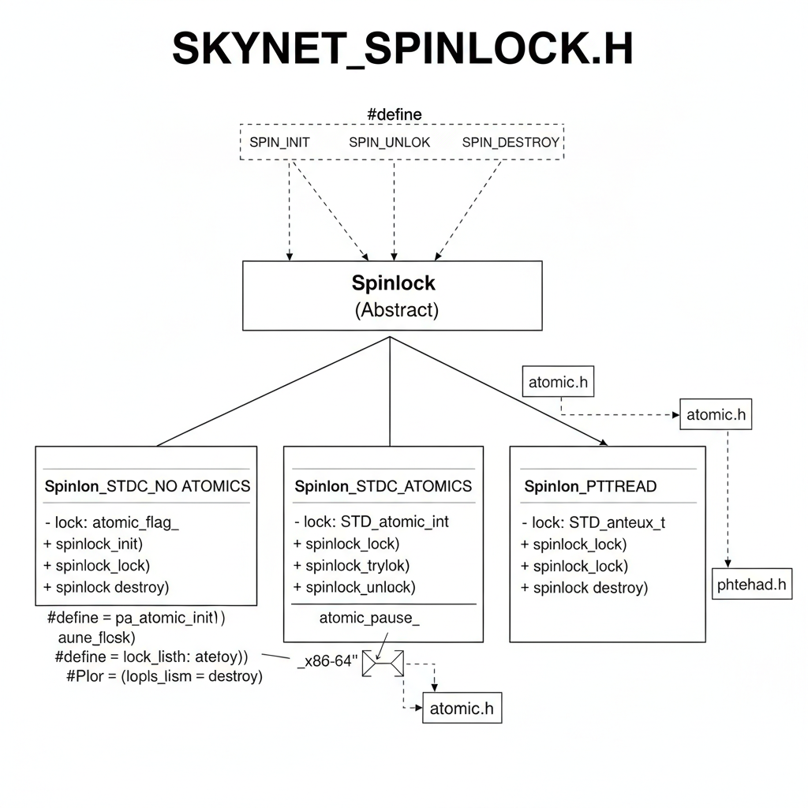

🎨 SKYNET_SPINLOCK.H 结构抽象图解释
这张图的核心思想是抽象层与实现层的分离，以实现代码在不同编译器和平台上的兼容性和性能优化。

1. 🌐 顶层抽象：Spinlock 接口
Spinlock (Abstract) 模块是整个设计的核心，代表了用户可见的抽象数据类型（struct spinlock）。

公共宏定义 (#define)：

SPIN_INIT、SPIN_LOCK、SPIN_UNLOCK、SPIN_DESTROY。

这些宏是用户接口。它们接收一个包含锁的结构体 q，然后调用底层实现的同名函数，例如 spinlock_init(&(q)->lock)。这使得用户代码保持简洁和通用。

2. ⚛️ 三种底层实现 (Implementation Paths)
该库根据不同的预处理器宏，提供了三种互相排斥的底层实现，这些实现都必须满足 spinlock_init/lock/unlock/destroy 这套接口规范。

A. 路径 1: Spinlock_STDC_NO_ATOMICS (GCC/Clang 内建函数降级)
条件： 编译器不支持 C11 标准原子操作（__STDC_NO_ATOMICS__ 被定义）。

锁类型 (- lock)： atomic_flag_ (通常是 volatile int 或 int)。

核心机制： 依赖于 GCC/Clang 的 __sync 内建函数（例如 __sync_lock_test_and_set）。

特点： 这是最低级的兼容层，确保代码在缺乏标准原子库的旧编译器或特殊平台上仍能编译运行。

B. 路径 2: Spinlock_STDC_ATOMICS (C11/C++11 标准原子)
条件： 编译器支持 C11/C++11 标准原子操作。

锁类型 (- lock)： STD_atomic_int（标准原子整数）。

核心机制：

依赖于标准库原子操作（通过 atomic.h 引入），例如 atomic_exchange_explicit。

引入了 atomic_pause_ 宏，该宏在 x86-64 架构下展开为 _mm_pause 指令。

特点： 这是现代、高性能的自旋锁实现。_mm_pause 指令在等待锁时会降低 CPU 功耗和提高自旋循环的效率。

C. 路径 3: Spinlock_PTHREAD (Pthread 互斥锁)
条件： 定义了 USE_PTHREAD_LOCK 宏。

锁类型 (- lock)： STD_anteux_t（应为 pthread_mutex_t，即 Pthread 互斥锁）。

核心机制： 直接调用 Pthread 库函数（pthread_mutex_init/lock/unlock）。

特点： 这不是一个真正的自旋锁，而是一个阻塞锁。当锁被占用时，线程会进入睡眠状态并释放 CPU。通常用于锁竞争激烈或锁持有时间较长的场景，以避免 CPU 浪费。

3. 🔗 依赖关系
Spinlock_STDC_ATOMICS 依赖于 atomic.h（引入标准原子类型和操作）。

Spinlock_PTHREAD 依赖于 pthread.h（引入 Pthread 互斥锁类型和函数）。

